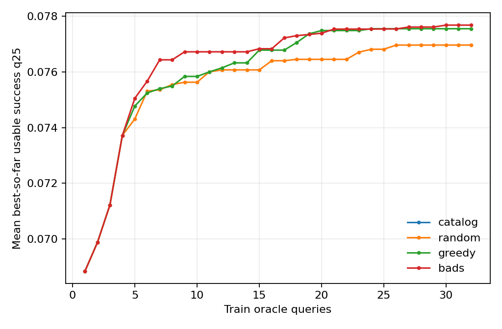
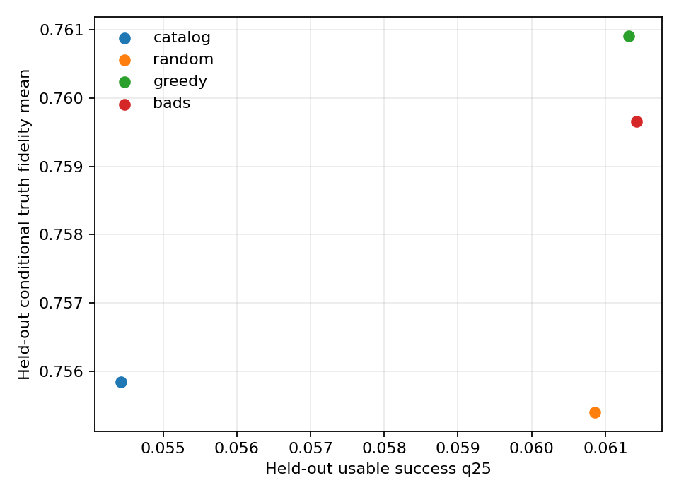

# QuantumOpt-Explorer

## Semifinal research report

**Track:** GOAI AI for Research — Open Exploration

**Participant:** Haoming Chen

**Release:** `semifinal-v2.0.0` | **Protocol tag:** `v2-protocol-freeze`

**Frozen configuration hash:** `7cdec90c727e7065f69adf12fd28b4c667a66063d2ba540985d5bea941cc60ca`

**Frozen protocol hash:** `e1240e0f9ec37bb6425f3b0d23d575abe11558053c58e00dadc9f3e94dd82ac1`

> Result: Outcome C, a reproducible negative pilot for the preregistered BADS advantage. BADS improved held-out usable-success q25 over the untuned catalog parameters in 8/8 paired device seeds, but did not clear the required advantage over equal-budget random search: 4 wins, 4 ties, and only +0.956% mean relative improvement versus a preregistered 6/8 and +10% requirement.

## Abstract

This work asks whether a finite-query search policy can calibrate a fixed heralded photonic CNOT against fabrication and phase error while preserving useful event probability under stronger held-out loss and phase noise. The project uses the public Perceval 1.2.4 catalog topology without changing its six beam splitters, two phase shifters, or herald structure. An action selects one eight-dimensional compensation vector from a fixed, physically deduplicated candidate corpus. The primary score is the lower-quartile unconditional probability of a correct logical output and an accepted herald, not a normalized fidelity alone.

Eight paired synthetic devices were evaluated. Random, nearest-greedy, and the disclosed Budget-Aware Diversity Search (BADS) each received 32 training-oracle queries, including the same four warm-up candidates. The untuned catalog setting was retained as a one-query control. Search observations used eight training-noise draws. Held-out metrics, based on 16 stronger asymmetric draws, were unavailable until a finalist was irreversibly frozen. A complete log contains 776 query events. Post-search context includes an exhaustive 128-candidate oracle and Perceval process tomography for all 32 finalists.

All three search policies improved materially over the catalog control, but BADS did not demonstrate the preregistered margin over random or nearest-greedy. BADS and greedy selected the same finalist in seven of eight seeds despite taking different exploration trajectories. This negative result narrows the contribution: the environment and decomposed physical metric are useful, but the current BADS acquisition rule is not justified as a superior optimizer.

## 1. Research question and contribution boundary

The research question was frozen before the full held-out run:

> Under a fixed heralded-CNOT topology and oracle-query budget, can a disclosed search policy find angular compensations whose lower-quartile usable success transfers to a stronger, asymmetric held-out noise mechanism better than the catalog parameters and random search?

The simulator starts from Perceval's public `heralded cnot` catalog circuit. The ideal zero-compensation implementation reproduces all four computational-basis CNOT mappings with conditional truth-table fidelity 1 and herald/usable success `2/27`. This value and topology are validation anchors, not discoveries.

The project contribution is an inspectable calibration benchmark:

- a one-way exploration API that prevents held-out access during search;
- an unconditional usable-event metric decomposed into correctness, heralding, false herald, leakage, and logical error;
- paired candidate, device, noise, warm-up, and query-budget controls;
- complete action-observation and post-freeze evidence; and
- a deterministic semantic golden verifier plus an independent semantic audit.

The work does not claim a new quantum gate, a new circuit topology, a physical-device result, or a general experiment-discovery system. MELVIN, Theseus, and PyTheus already address broader automated quantum-optical experiment and topology discovery. Automated photonic self-configuration is also established prior art. V2 instead studies a narrow fixed-topology calibration protocol.

## 2. Exploration environment

### 2.1 State and action

The public state machine is:

```text
reset(seed) -> query(candidate) -> freeze(candidate) -> evaluate_heldout()
```

Each device seed deterministically defines 128 candidates, one static six-element beam-splitter offset, eight training-noise draws, and — only after `freeze` — 16 held-out draws. Candidate 0 is the unmodified catalog parameter vector. Every other candidate contains six beam-splitter angle compensations and two phase compensations in radians. Beam-splitter parameters are canonicalized modulo four pi radians and phase parameters modulo two pi radians; generation and tests reject physical aliases.

The policy receives a candidate ID, all eight compensation values, and training metrics after each query. It never receives a held-out statistic, distribution summary, or noise schedule during selection. `freeze` is irreversible, forbids further queries, and materializes the held-out schedule. A separate exhaustive held-out oracle runs only after all policies for a device have frozen and is explicitly marked unavailable to policies.

### 2.2 Optical evaluator

Every noise draw evaluates all four dual-rail computational inputs: `00`, `01`, `10`, and `11`. The fixed six-mode processor contains six beam splitters and two internal phase shifters. Mode-specific loss is implemented with native Perceval `LC` components. Loss events remain in the output distribution so an unconditional rate is not silently renormalized into conditional accuracy.

For each input, the evaluator separates:

- usable success: correct logical output and exactly one photon in each herald mode;
- herald probability: accepted herald regardless of logical validity;
- false-herald probability: accepted herald without the correct logical output;
- leakage: accepted herald outside the one-photon-per-dual-rail logical subspace; and
- logical error: accepted valid logical state with the wrong truth-table output.

The per-draw conditional truth-table fidelity is correct probability divided by accepted-herald probability. The primary policy score is the 25th percentile of per-draw usable success. The 10th percentile and means are secondary diagnostics. A separate post-freeze process tomography is never conflated with truth-table fidelity.

### 2.3 Noise model and held-out shift

The three in-scope mechanisms are a static per-device beam-splitter offset, per-evaluation phase error, and mode-specific linear loss. Training phase errors are centered and mild. Held-out phase errors are stronger, correlated, and asymmetrically biased. Held-out losses have higher mean and variance, a common correlated term, and disclosed mode biases. The static beam-splitter offset is shared across train and held-out for the paired device.

Source brightness, multiphoton contamination, partial distinguishability, detector inefficiency, dark counts, time drift, crosstalk, control quantization, and measured hardware priors are out of scope. The noise schedule is a transparent synthetic stress test, not a fitted laboratory population.

## 3. Frozen experimental design

| Design element | Frozen value |
| --- | ---: |
| Paired device seeds | 8 (`1701`–`1708`) |
| Candidates per device | 128 |
| Search policies | random, nearest-greedy, BADS |
| Queries per search policy | 32 |
| Shared warm-up queries | 4 |
| Catalog control | candidate 0, one query |
| Training draws per query | 8 |
| Held-out draws per finalist | 16 |
| Logical inputs per draw | 4 |
| Frozen finalists | 32 |
| Logged query events | 776 |
| Post-search oracle rows | 1,024 |
| Process-tomography rows | 32 |

BADS is the repository's disclosed local benchmark rule, not a claim to reproduce a separately published optimizer. It combines a kernel-weighted score prediction with a budget-decaying distance bonus. Nearest-greedy queries the unused candidate closest to the current best. Random samples uniformly from unused candidates using a local seed-derived generator. The three search policies share candidate pools, device offsets, noise schedules, warm-up IDs, and total budgets.

The full configuration, code-level protocol contract, and outcome rule were frozen at commit `479530929cbbc97bffe247c2ca0d60b60f4a8e13` and tag `v2-protocol-freeze`. A later provenance-only fix moved Git-state capture before owned output creation; it did not change any seed, candidate, policy, metric, threshold, configuration, protocol hash, or scientific output.

### 3.1 Preregistered outcome rule

Outcome A required BADS, relative to both catalog and random, to satisfy all three conditions: at least six wins among eight held-out paired seeds; at least 10% mean relative improvement in held-out usable-success q25; and no more than 0.01 mean decline in conditional truth-table fidelity.

Outcome B required a same-direction train/held-out policy-ranking reversal in at least six seeds, interpreted only as a mechanism-shift crossover. Outcome C was the complete reproducible null/negative case when neither A nor B held. Process tomography was a preregistered diagnostic and did not add a fourth outcome gate.

<!-- PAGEBREAK -->

## 4. Results

### 4.1 Primary held-out result

| Policy | Train q25 | Held-out q25 | Held-out conditional fidelity | Herald probability | Mean oracle regret |
| --- | ---: | ---: | ---: | ---: | ---: |
| Catalog | 0.068848 | 0.054424 | 0.755840 | 0.074932 | 0.006994 |
| Random | 0.076967 | 0.060853 | 0.755400 | 0.083799 | 0.000566 |
| Nearest-greedy | 0.077553 | 0.061316 | 0.760909 | 0.083768 | 0.000103 |
| BADS | 0.077683 | 0.061419 | 0.759660 | 0.084066 | 0.000000 |

All values are means across the eight paired device seeds. `q25` denotes the within-finalist lower quartile across noise draws. The table is descriptive; eight seeds do not support a broad population claim.



### 4.2 Preregistered comparisons

| Comparison | Wins / ties | Mean q25 difference | Mean relative change | Fidelity difference | Decision |
| --- | ---: | ---: | ---: | ---: | --- |
| BADS vs catalog | 8 / 0 | +0.006994 | +12.907% | +0.003820 | All A subchecks pass |
| BADS vs random | 4 / 4 | +0.000566 | +0.956% | +0.004260 | Win-count and 10% checks fail |
| BADS vs greedy | 1 / 7 | +0.000103 | +0.167% | -0.001249 | Descriptively near-equivalent |
| Random vs catalog | 8 / 0 | +0.006429 | +11.841% | -0.000440 | Calibration signal |
| Greedy vs catalog | 8 / 0 | +0.006892 | +12.724% | +0.005069 | Calibration signal |

The BADS-minus-random normal-approximation 95% interval for the paired absolute difference is `[+0.000080, +0.001052]`. It is retained as a small descriptive signal, not used to bypass the preregistered minimum effect and win-count requirements. BADS therefore failed Outcome A. No comparison showed the six-seed ranking reversal required for Outcome B. The frozen result is Outcome C.

The post-search finite-pool oracle adds useful context. BADS selected the held-out best candidate in 8/8 seeds, greedy in 7/8, and random in 4/8. This does not rescue the BADS claim: BADS and greedy selected the same finalist in seven seeds, and random selected the same finalist as BADS in four. Their query trajectories were not identical, but the finite corpus and strong train/held-out rank alignment made a cheap baseline difficult to beat by the preregistered margin.



### 4.3 Metric decomposition

BADS increased mean held-out herald probability from the catalog's `0.074932` to `0.084066`, while conditional truth-table fidelity rose from `0.755840` to `0.759660`. Mean false-herald probability was `0.020323` for BADS versus `0.018426` for catalog, and mean leakage was `0.019601` versus `0.018259`. These simultaneous changes are why the primary metric remains unconditional usable success and why each component is exported rather than collapsed into a single normalized score.

### 4.4 Process-tomography diagnostic

Perceval process tomography completed for every frozen finalist at preregistered held-out draw 0. BADS mean average gate fidelity was `0.800664` (range `0.769459`–`0.835307`), compared with catalog `0.804563`, random `0.795923`, and greedy `0.801930`. BADS was within the disclosed 0.01 noninferiority margin of catalog and random, but its mean was below the diagnostic `0.90` coherence threshold. The maximum chi-matrix Hermiticity residual was `2.87e-15`.

Tomography gate efficiency, reported separately from normalized process fidelity, averaged `0.057026` for catalog, `0.064158` for random, `0.064698` for greedy, and `0.064840` for BADS. Because tomography uses one held-out realization per finalist, these values are diagnostic rather than a replacement for the 16-draw primary evaluation.

## 5. Interpretation of the negative result

The experiment supports a narrow positive calibration statement: under this synthetic stress test, searching the fixed candidate corpus improved usable success over leaving the catalog angles uncalibrated. It does not support the stronger method statement that the current BADS rule is meaningfully better than equal-budget random or nearest-greedy search.

Three conclusions follow without changing the frozen question:

- The environment is nontrivial enough for calibration to matter: every search policy beat catalog in every paired seed.
- The policy comparison is not yet discriminative: BADS and nearest-greedy converged to the same finalist in seven seeds, and BADS exceeded random by less than one percent on average.
- A follow-up should increase candidate/topology diversity and preregister BADS ablations before adding more noise mechanisms. It should not tune this held-out set or relabel the result.

The negative result also clarifies the V1-to-V2 revision. The frozen V1 experiment found no BADS advantage and used a normalized transfer-matrix fidelity that was almost insensitive to common attenuation; survival carried more than 99% of the absolute train-to-held-out metric gap. V2 made usable event probability primary and modeled loss natively. That repair improved measurement validity but did not create optimizer superiority.

## 6. Inspectability and reproducibility

The release preserves every decision-relevant layer:

- `query_log.jsonl`: 776 timed action-observation events with policy, step, candidate ID, eight parameters, training metrics, reason, remaining budget, and stop reason;
- `freeze_log.jsonl` and `heldout_results.jsonl`: explicit one-way boundary and finalist outcomes;
- `candidate_pool.csv` and `noise_schedule.csv`: complete synthetic inputs;
- `postsearch_oracle.csv`: context-only regret with `available_to_policy=false`;
- `process_tomography.csv/jsonl`: scalar diagnostics and chi matrices;
- `summary.csv`, `comparisons.csv`, `discovery_gate.json`, and figures: derived evidence;
- `run_manifest.json`: source commit, dependency versions, platform, hashes, seeds, budgets, and artifact digests; and
- `evidence/golden_summary.json`: an external fixture that compares deterministic scientific outputs while normalizing only machine-dependent query timing.

The built-in verifier first checks each raw artifact against its run-manifest hash, then checks deterministic outputs against the external golden fixture, and finally rejects any held-out field in the query log. The independent semantic verifier recomputes hashes and expected row counts, tests budgets and shared warm-up IDs, validates probability ranges, and cross-checks candidate, freeze, held-out, oracle, and tomography identities.

### 6.1 Reproduction

```bash
git clone https://github.com/Barca0412/QuantumOpt-Explorer.git
cd QuantumOpt-Explorer
./reproduce.sh --smoke
./reproduce.sh --full
```

The shell entry point finds `uv` either on `PATH` or at `$HOME/.local/bin`, installs the frozen lockfile, runs all tests, executes the selected configuration, and invokes the external golden verifier for the full run. The equivalent package interface is:

```bash
python -m quantumopt_v2 run --config configs/v2_pilot.json --output runs/v2
python -m quantumopt_v2 verify --run runs/v2 --golden evidence/golden_summary.json
```

The simulator itself makes no network call. Internet access is needed only for initial dependency installation. Generated scientific tables are deterministic; raw wall-clock query times and the operational log are intentionally machine-dependent and excluded from the cross-machine semantic hash.

## 7. Open-source and sustainability

The public repository releases source, tests, frozen configs, logs, synthetic schedules, derived evidence, documentation, and report. Source is MIT licensed, generated tabular/JSON data is CC0, and narrative/figures are CC BY 4.0. Direct and transitive dependency versions are frozen in `pyproject.toml` and `uv.lock`; third-party roles and licences are disclosed in `THIRD_PARTY_NOTICES.md`.

The immutable preliminary package remains available at `round1-v1.0.0` and under `archive/v1/`. The V1 raw evidence is preserved byte-for-byte, while its metric-sensitivity and physical-duplicate analyses are clearly labeled post-hoc. The V2 API and artifact schemas can be reused for other fixed heralded gates, but any change in topology, hardware prior, or noise family requires a new protocol hash and a new evaluation split.

## 8. Limitations and next experiment

The study has eight synthetic devices, one catalog topology, a finite random candidate corpus, one hand-designed BADS rule, and no independent hardware or quantum-optics validation. Its normal-approximation intervals are descriptive. The held-out distribution is stronger by construction and cannot establish prevalence in manufactured devices. Process tomography uses one realization per finalist and is not a hardware characterization.

A credible V3 should use measured or externally justified device priors; add source impurity, partial distinguishability, detector behavior, drift, and control cost; expand to multiple published gate/topology families; compare stronger optimizers; and use a fresh untouched test distribution. The present held-out seeds must not become V3's final evaluation set.

## 9. Evidence-to-rubric map

| Official dimension | Weight | Direct release evidence |
| --- | ---: | --- |
| Problem definition and environment design | 45% | Frozen protocol/config, state machine, optical evaluator, leakage tests, claims boundary |
| Exploration process and research signals | 35% | 776-event query log, paired baselines, held-out results, oracle regret, tomography, honest Outcome C |
| Inspectability and sustainability | 15% | Run manifest, raw/aggregate artifacts, independent semantic verifier, golden fixture, clean-clone reproduction |
| Open-source contribution | 5% | Public repository, reusable package, CI, fixed releases, licences, V1 archive |

## References

- GOAI, [Semifinal judging officially launches](https://www.goaihz.com/en/news/Global%20Open-source%20AI%20Challenge%20Semi-Final%20Judging%20Officially%20Launches), 2026-09-04.
- GOAI, [AI for Research track](https://www.goaihz.com/tracks?track=ai4s), accessed 2026-09-05.
- Quandela, [Perceval component catalog](https://perceval.quandela.net/docs/v1.2/reference/components/catalog.html), v1.2.
- Quandela, [Perceval process-tomography walkthrough](https://perceval.quandela.net/docs/v1.2/notebooks/Tomography_walkthrough.html), v1.2.
- Quandela, [Perceval NoiseModel](https://perceval.quandela.net/docs/v1.2/reference/utils/noise_model.html), v1.2.
- Krenn et al., [Automated Search for New Quantum Experiments](https://doi.org/10.1103/PhysRevLett.116.090405), Physical Review Letters 116, 2016.
- Krenn et al., [Conceptual Understanding through Efficient Automated Design of Quantum Optical Experiments](https://doi.org/10.1103/PhysRevX.11.031044), Physical Review X 11, 2021.
- Ruiz-Gonzalez et al., [Digital Discovery of 100 diverse Quantum Experiments with PyTheus](https://doi.org/10.22331/q-2023-12-12-1204), Quantum 7, 2023.
- Pérez-López et al., [Multipurpose self-configuration of programmable photonic circuits](https://doi.org/10.1038/s41467-020-19608-w), Nature Communications 11, 2020.
- Uskov et al., [Maximal success probabilities of linear-optical quantum gates](https://doi.org/10.1103/PhysRevA.79.042326), Physical Review A 79, 2009.
