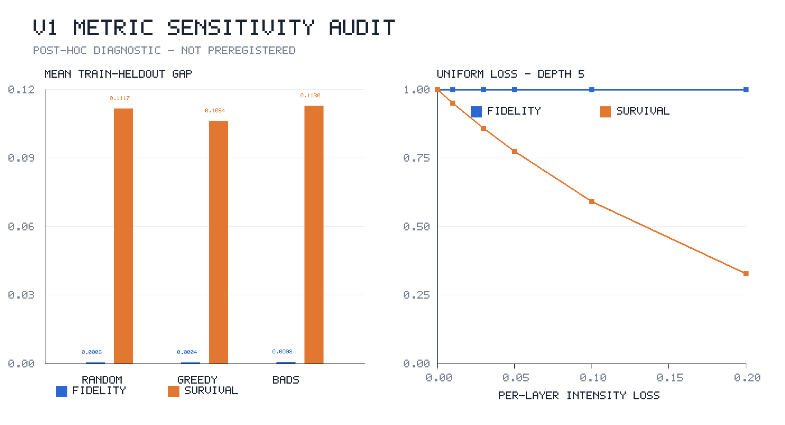

# V1 metric-sensitivity diagnostic

**Status:** `POST-HOC` analysis of frozen V1 artifacts; not part of the
preregistered discovery gate.

## Result in one sentence

The V1 held-out loss shift is visible primarily in single-photon survival, not in
normalized process fidelity: across policies, survival carries `99.26%–99.65%` of
the sum of the two absolute mean train-to-held-out gaps.



## Why uniform attenuation disappears from normalized fidelity

V1 defines normalized process fidelity as

```text
F_norm(U, A) = |Tr(U†A)|² / [Tr(U†U) Tr(A†A)].
```

If loss only rescales the target transfer matrix, `A = αU`, then

```text
F_norm(U, αU) = 1
survival(αU) = Tr((αU)†(αU)) / m = |α|².
```

Thus normalized fidelity measures whether the transfer matrix points in the
correct normalized direction; it deliberately removes global throughput. This is
not a coding error, but it means normalized fidelity alone cannot measure the
uniform component of optical loss.

The V1 simulator inserts
`diag(sqrt(1 - intensity_loss))` after each layer. Under exactly uniform
per-mode loss and depth five, the implemented formulas give:

| Uniform intensity loss per layer | Normalized fidelity | Survival after 5 layers |
| ---: | ---: | ---: |
| 0.00 | 1.000000 | 1.000000 |
| 0.03 | 1.000000 | 0.858734 |
| 0.10 | 1.000000 | 0.590490 |
| 0.20 | 1.000000 | 0.327680 |

The full deterministic sweep is
[`v1_uniform_loss_sweep.csv`](../evidence/v1_uniform_loss_sweep.csv). The metric
implementation is frozen at
[`quantumopt_experiment.py`](../archive/v1/reproducibility/src/quantumopt_experiment.py#L232-L260).

## Empirical frozen-output comparison

The following values are means over the 12 paired V1 episodes. A gap is training
minus held-out, so a positive value denotes degradation under the held-out shift.

| Policy | Fidelity gap | Survival gap | Survival / fidelity absolute-gap ratio | Survival share |
| --- | ---: | ---: | ---: | ---: |
| Random | 0.000643 | 0.111683 | 173.7× | 99.43% |
| Greedy | 0.000371 | 0.106403 | 287.0× | 99.65% |
| BADS | 0.000840 | 0.112987 | 134.5× | 99.26% |

Across the three policy means, the average fidelity gap is `0.000618` and the
average survival gap is `0.110358`, a ratio of `178.6×`. These are descriptive
comparisons of different metrics, not standardized effect sizes.

The exact values, medians and existing episode-bootstrap intervals are in
[`v1_metric_sensitivity_by_policy.csv`](../evidence/v1_metric_sensitivity_by_policy.csv).

## Pattern-level diagnostic

To avoid treating between-circuit variation as loss sensitivity, the primary
diagnostic computes Pearson correlation separately inside each selected
candidate's loss-pattern series and then summarizes the 36 candidate/policy
groups per split.

| Split | Metric | Pattern rows | Mean within-candidate correlation with mean loss | Median correlation |
| --- | --- | ---: | ---: | ---: |
| Train | Normalized fidelity | 576 | 0.0821 | 0.0710 |
| Train | Single-photon survival | 576 | −0.999995 | −0.999995 |
| Held-out | Normalized fidelity | 864 | −0.0283 | −0.0446 |
| Held-out | Single-photon survival | 864 | −0.999916 | −0.999923 |

The near-perfect negative survival correlation is expected under the current
single-photon diagonal-loss model. The near-zero average fidelity correlation is
consistent with scale normalization; individual groups can still respond to
asymmetric mode loss. Exact ranges and aggregate correlations are in
[`v1_metric_sensitivity_correlations.csv`](../evidence/v1_metric_sensitivity_correlations.csv).

## Interpretation boundary

`VERIFIED`:

- The algebraic metric is exactly invariant to non-zero scalar attenuation.
- V1 survival falls by roughly 0.11 from training to held-out conditions, while
  normalized fidelity changes by less than 0.001 on average for every policy.
- The V1 discovery gate failed; this diagnostic does not alter that decision.

`POST-HOC`:

- The current held-out shift tests throughput much more strongly than normalized
  transformation quality.
- Survival should be co-primary, or the next study should preregister a joint
  physical utility whose scale and interpretation are independently justified.
- Correlation does not identify the cause of BADS underperformance.

`FUTURE WORK`:

- Separate common-mode attenuation from mode-asymmetric and component-specific
  perturbations.
- Validate sensitivity using multiphoton state fidelity, source/detector effects,
  partial distinguishability and fabrication errors.
- Repeat across target and topology families before making a general robustness
  claim.

## Reproduction

No external package is required:

```bash
python3 analysis/v1_metric_sensitivity.py
python3 analysis/verify_v1_golden.py
```

The first command regenerates all `evidence/v1_metric_sensitivity*`,
`evidence/v1_uniform_loss_sweep.csv`, and
`evidence/v1_phenotype_duplicates.csv` files. The second command independently
verifies semantic counts, aggregate means, paired effects, gate logic, query
fairness, loss-schedule shape, phenotype duplicates, and compressed-evidence
equivalence against the frozen fixture.
